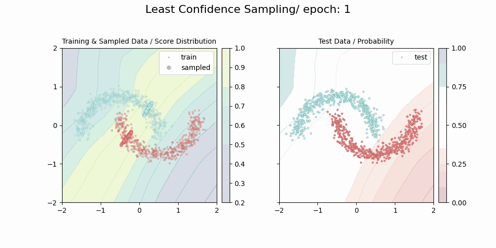
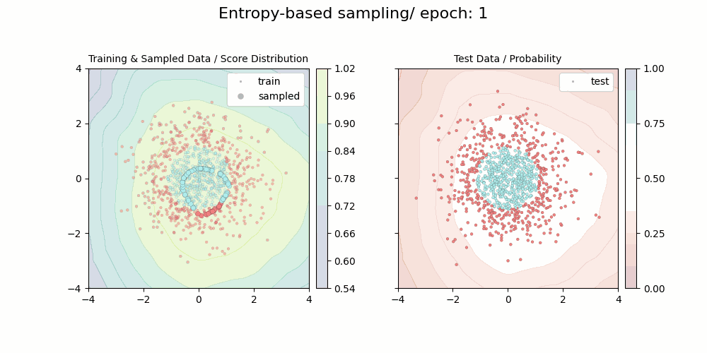
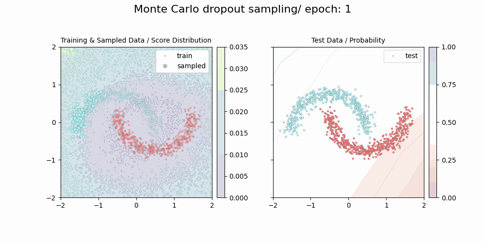
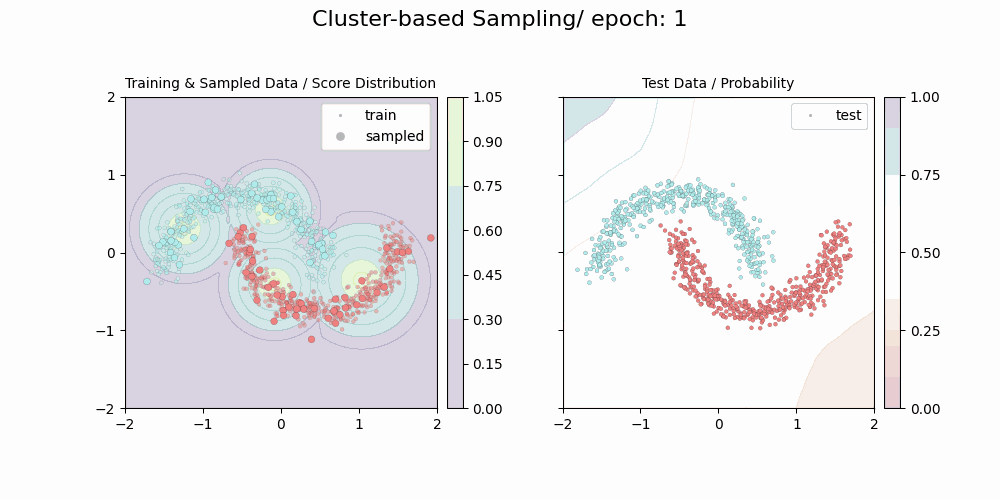
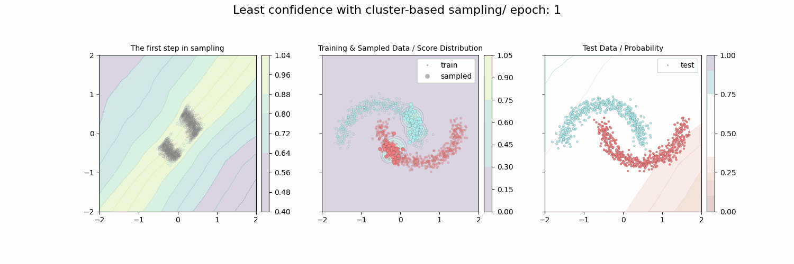
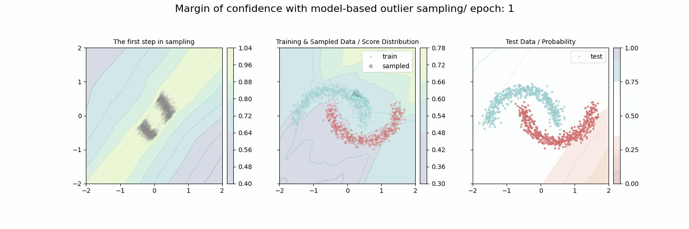
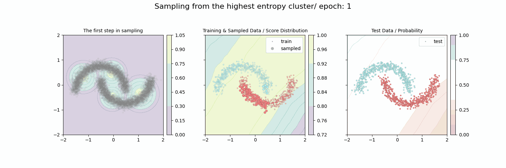

# pytorch-active-learning

**Active Learning with PyTorch**

This implementation is based on ["Human-in-the-Loop Machine Learning: Active learning and annotation for human-centered AI"](https://www.manning.com/books/human-in-the-loop-machine-learning). official repository: [URL](https://github.com/rmunro/pytorch_active_learning)



## Requirement

```
jupyter==1.0.0
matplotlib==3.5.1
numpy==1.22.3
pandas==1.4.2
Pillow==9.1.0
scikit-learn==1.0.2
scipy==1.8.0
torch==1.10.1
torchmetrics==0.8.1
torchvision==0.11.2
```

---

## Uncertainty Sampling

### Usage

```
python uncertainty_sampling.py --algorithm {least,margin,ratio,entropy,montecarlo} --data {moons,circles,gaussian,blobs}
```

- algorithm
  - least: Least condidence sampling
  - margin: Margin of confidence sampling
  - ratio: Ratio of confidence sampling
  - entropy: Entropy-based sampling
  - montecarlo: Monte Carlo dropout sampling
- data
  - moons: [sklearn.datasets.make_moons](https://scikit-learn.org/stable/modules/generated/sklearn.datasets.make_moons.html)
  - circles: [sklearn.datasets.make_circles](https://scikit-learn.org/stable/modules/generated/sklearn.datasets.make_circles.html)
  - gaussian: [sklearn.datasets.make_gaussian_quantiles](https://scikit-learn.org/stable/modules/generated/sklearn.datasets.make_gaussian_quantiles.html)
  - blobs: [sklearn.datasets.make_blobs](https://scikit-learn.org/stable/modules/generated/sklearn.datasets.make_blobs.html)

### Examples

Entropy-based sampling & make_gaussian_quantiles dataset



Monte Carlo dropout sampling & make_moons dataset



---

## Diversity Sampling

### Usage

```
python diversity_sampling.py --algorithm {outlier,cluster,random} --data {moons,circles,gaussian,blobs}
```

- algorithm
  - outlier: Model-based outlier sampling
  - cluster: Cluster-based sampling
  - random: Random sampling
- data
  - moons: [sklearn.datasets.make_moons](https://scikit-learn.org/stable/modules/generated/sklearn.datasets.make_moons.html)
  - circles: [sklearn.datasets.make_circles](https://scikit-learn.org/stable/modules/generated/sklearn.datasets.make_circles.html)
  - gaussian: [sklearn.datasets.make_gaussian_quantiles](https://scikit-learn.org/stable/modules/generated/sklearn.datasets.make_gaussian_quantiles.html)
  - blobs: [sklearn.datasets.make_blobs](https://scikit-learn.org/stable/modules/generated/sklearn.datasets.make_blobs.html)

### Examples

Model-based outlier sampling & make_gaussian_quantiles dataset


Cluster-based sampling & make_moons dataset



---

## Advanced active learning

### Least confidence with cluster-based sampling

```
python least_cluster_sampling.py --data {moons,circles,gaussian,blobs}
```



### Margin of confidence with model-based outlier sampling

```
python margin_outlier_sampling.py --data {moons,circles,gaussian,blobs}
```



### Sampling from the highest entropy cluster

```
python cluster_entropy_sampling.py --data {moons,circles,gaussian,blobs}
```
