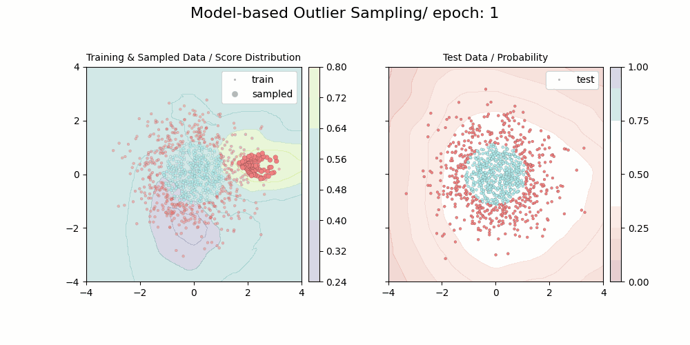

# pytorch-active-learning

Active Learning with PyTorch


## Requirement

```
jupyter==1.0.0
matplotlib==3.5.1
numpy==1.22.3
pandas==1.4.2
Pillow==9.1.0
scikit-learn==1.0.2
scipy==1.8.0
torch==1.10.1+cu111
torchmetrics==0.8.1
torchvision==0.11.2+cu111
```

## Uncertainty Sampling

```
python uncertainty_sampling.py -a entropy -d gaussian
```


## Diversity Sampling

```
python diversity_sampling.py -a outlier -d gaussian
```


